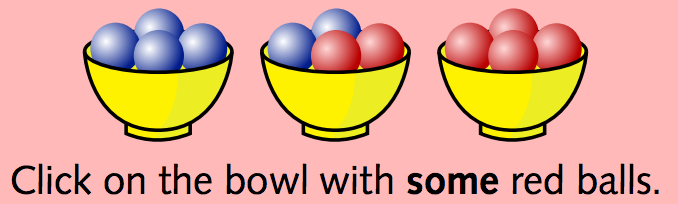

<script src="https://use.fontawesome.com/c2cd983497.js"></script>
<a href="https://github.com/mikabr/prag-words" target="_blank"><i class="fa fa-github fa-2x" aria-hidden="true"></i></a>

```{r setup, message=FALSE, warning=FALSE, echo=FALSE}
library(dplyr)
library(purrr)
library(tidyr)
library(DirichletReg)
library(ggplot2)
library(langcog)
library(foreach)
theme_set(theme_mikabr(base_family = "Source Sans Pro"))
knitr::opts_chunk$set(message = FALSE, warning = FALSE, tidy = FALSE,
                      cache = TRUE)
```

# Overview

What role does pragmatic reasoning play in word learning? As a child interacts with the world and acquires their native language, they need to figure out both what words mean in general (semantics) and what they mean in a specific contexts (pragmatics). A number of models have explored how a learner might accomplish each of these tasks independently: cross-situational word learning models build a lexicon from observed data, while pragmatic reasoning models use an assumed lexicon to make inferences about intended meanings in context. To build a learner that can solve both problems jointly, a model would need to encode uncertainty over the lexicon and combine the mechanisms of word learning and pragmatic reasoning to both learn a lexicon and infer contextual meaning.

One model that attempts this combination is [Smith 2013](https://papers.nips.cc/paper/4929-learning-and-using-language-via-recursive-pragmatic-reasoning-about-other-agents.pdf). In this framework, speakers and listeners are modeled as not starting off knowing a lexicon, but assuming that a conventional lexicon exists and that others know this lexicon. These assumptions avoid the exponential complexity of propagating uncertainty over lexica through levels of reasoning about others and allow the model to use the machinery of pragmatic inference to infer probable lexica given observed data. Simulations using this model capture phenomena from word learning, pragmatic reasoning, and their interaction.

This project is a re-implementation of the Smith 2013 model and an attempt to replicate its simulation results, some of which turn out very similar to the original results, while others do not --- it remains to be seen whether the sources of these discrepancies lie in the mathematical structure of the models, their implementational specifics, the setup of the simulations, or something else.


# Model

## RSA

The foundation of the model is the Rational Speech Acts (RSA) framework, in which speakers and listeners reason about each other recursively. The recursion grounds out in a literal listener $L_0$, who interprets a word $w$ using their prior over objects $o$ and the entry for the word in their lexicon $\mathcal{L}$:

$$ L_0(w|o,\mathcal{L}) \propto \mathcal{L}(o,w) \cdot P(o)$$

```{r}
# log probability of object given word and lexicon
listener_literal <- function(lexicon, params) {
  function(object, word) {
    p_object <- function(o_i) filter(lexicon, w == word, o == o_i)$p *
      params$object_prior[o_i]
    log(p_object(object)) - log(sum(map_dbl(params$objects, p_object)))
  }
}
```

A pragmatic speaker chooses a word $w$ given an object $o$ to which they want to refer such that they soft-maximize the probability that the listener will assign to that object:

$$ S_n(w|o,\mathcal{L}) \propto \text{exp} (\lambda (\log{L_{n-1}(o|w,\mathcal{L}) - \text{cost}(w)})) $$

```{r}
# level n pragmatic speaker's log posterior of word given object and lexicon
# n ∈ {1, 3, 5, ...}
speaker_n <- function(n, lexicon, params) {
  function(object, word) {
    p_word <- function(w_i) {
      params$lambda * (listener_n(n - 1, lexicon, params)(object, w_i) -
                         params$word_cost[w_i])
    }
    p_word(word) - log(sum(exp(map_dbl(params$words, p_word))))
  }
}
```

A pragmatic listener, in turn, uses Bayes' rule to in invert the speaker's decision rule:

$$ L_n(o|w,\mathcal{L}) \propto S_{n-1}(w|o,\mathcal{L}) \cdot P(o) $$

```{r}
# level n pragmatic listener's log posterior of object given word and lexicon
# n ∈ {0, 2, 4, ...}
listener_n <- function(n, lexicon, params) {
  if (n == 0) {
    listener_literal(lexicon, params)
  } else {
    function(object, word) {
      p_object <- function(o_i) {
        speaker_n(n - 1, lexicon, params)(o_i, word) + params$object_prior[o_i]
      }
      p_object(object) - log(sum(exp(map_dbl(params$objects, p_object))))
    }
  }
}
```

## Conventionality

A conventional listener and speaker behave like the RSA listener and speaker above, but without knowing the lexicon a priori. Instead of a known lexicon, each of them has observed data in the form of word-object pairs. A conventional listener at level $n$ treats their data $D_L$ as samples from a knowledgeable speaker $S_{n-2}$, and a conventional speaker at level $n$ treats their data $D_S$ as samples from a knowledgeable speaker $L_{n-1}$. Each of them combines the likelihood of a given lexicon under that assumed generating distribution with their prior over lexica to compute a posterior over lexica. So for the conventional listener:

$$ P_L(\mathcal{L}|D_L) \propto P(\mathcal{L}) \cdot \prod_i{S_{n-2}(w_i|o_i,\mathcal{L})} $$

And analogously for the conventional speaker:

$$ P_S(\mathcal{L}|D_S) \propto P(\mathcal{L}) \cdot \prod_i{L_{n-1}(o_i|w_i,\mathcal{L})} $$

```{r}
# log likelihood of lexicon given data and assumed generating distribution
lexicon_likelihood <- function(data, generator) {
  if (is.null(data)) return(0)
  sum(map_dbl(data, ~generator(.x$object, .x$word)))
}

# log posterior of a lexicon given data and assumed generating distribution
lexicon_posterior <- function(lexicon, data, generator, params) {
  params$lexicon_prior(lexicon) + lexicon_likelihood(data, generator)
}

# level n conventional listener's log posterior of lexicon given data
# n \in {1, 3, 5, ...}
listener_lexicon_posterior <- function(n, params) {
  function(lexicon, data) {
    if (n < 2) {
      generator <- listener_literal(lexicon, params)
    } else {
      generator <- speaker_n(n - 2, lexicon, params)
    }
    lexicon_posterior(lexicon, data, generator, params)
  }
}

# level n conventional speaker's log posterior of lexicon given data
# n \in {1, 3, 5, ...}
speaker_lexicon_posterior <- function(n, params) {
  function(lexicon, data) {
    generator <- listener_n(n - 1, lexicon, params)
    lexicon_posterior(lexicon, data, generator, params)
  }
}
```

## Inference

Since the space of possible lexica is infinite, to compute the expected value of the posterior over lexica we do importance sampling. For each sample:

- sample a lexicon from the importance distribution, a Dirichlet distribution over objects for each word
- compute the probability density of the sampled lexicon under the importance distribution
- compute the posterior probability of the sampled lexicon
- use the ratio of the lexicon's posterior probability to importance probability as its weight

The inferred lexicon is then the weighted mean of all the sampled lexica.

```{r}
# sample a lexicon from a dirichlet distribution over objects per word
lexicon_sample <- function(params, lexicon_concentrations) {
  rdirichlet(length(params$words), lexicon_concentrations) %>%
    `colnames<-`(params$objects) %>%
    as_data_frame() %>%
    mutate(w = params$words) %>%
    gather_("o", "p", params$objects)
}

# log probability density of a given lexicon under dirichlet
lexicon_importance <- function(lexicon, params, lexicon_concentrations) {
  lexicon %>%
    spread(o, p) %>%
    select(-w) %>%
    as.matrix() %>%
    ddirichlet(lexicon_concentrations, log = TRUE, sum.up = TRUE)
}

# one importance sample of a lexicon with resulting weight
lexicon_importance_sample <- function(i, posterior_fun, data, params,
                                      lexicon_concentrations) {
  lexicon <- lexicon_sample(params, lexicon_concentrations)
  p_importance <- lexicon_importance(lexicon, params, lexicon_concentrations)
  p_posterior <- posterior_fun(lexicon, data)
  ratio <- p_posterior - p_importance
  lexicon %>% mutate(sample = i, weight = exp(ratio))
}

# importance samples of lexica with corresponding weights
# posterior_fun is either listener_lexicon_posterior(n, params)
#   or speaker_lexicon_posterior(n, params)
lexicon_importance_samples <- function(num_samples, posterior_fun, data,
                                       params, lexicon_concentrations) {
  1:num_samples %>%
    map_df(~lexicon_importance_sample(.x, posterior_fun, data, params,
                                      lexicon_concentrations))
}

# mean lexicon of a set of samples, weighted by their weights
mean_lexicon <- function(lexicon_samples) {
  lexicon_samples %>%
    group_by(w, o) %>%
    summarise(mean_p = weighted.mean(p, weight))
}
```

# Simulations

Each simulation specifies:

- a _world_ (set of all possible words and set of all possible objects)
- model _parameters_ (prior over objects, prior over lexica, word costs, and rationality greediness $\lambda$) --- these are all assumed to be shared among listener and speaker
- [for some simulations] _data_ (listener and speaker's respective sets of observed word-objects pairs)

```{r}
# given a world as list(objects = c(...), words = c(...))
# returns default parameter values (uniform priors and costs) for that world
default_params <- function(world) {
  
  num_objects <- length(world$objects)
  num_words <- length(world$words)
  
  list(
    
    words = world$words,
    objects = world$objects,
    
    # prior over objects
    object_prior = 1 / num_objects %>% rep(num_objects) %>%
      set_names(world$objects),
    
    # log prior over lexica
    lexicon_prior = function(lexicon) 0,
    
    # log cost of words
    word_cost = 0 %>% rep(num_words) %>% set_names(world$words),
    
    # greediness of speaker's choice rule
    lambda = 3
    
  )
}
```

Some helper functions for transformations used across simulations:

```{r}
# given a lexicon with truth values for each object and word pair, construct a stochastic lexicon that has normalized noisy probabilities of words referring to each of their truth-conditionally referential objects
stochastify_lexicon <- function(lexicon, noise = 0.01) {
  lexicon %>%
    mutate(noisy_true = abs(true - noise)) %>%
    group_by(w) %>%
    mutate(p = noisy_true / sum(noisy_true)) %>%
    select(-noisy_true)
}

# given a lexicon, construct Dirichlet concentration parameters that reflect the truth values of the lexicon
lexicon_concentrations <- function(lexicon, conc_ratio = 20) {
  lexicon %>%
    mutate(conc = true * (conc_ratio - 1) + 1) %>%
    select(o, w, conc) %>%
    spread(o, conc) %>%
    ungroup() %>%
    select(-w) %>%
    as.matrix()
}

# given a lexicon and pragmatic agent (listener_n() or speaker_n()), compute that agent's conditional probability of each word given each object (or vice versa)
agent_posterior <- function(lexicon, agent) {
  lexicon %>%
    mutate(pragmatic = map2_dbl(o, w, ~exp(agent(.x, .y)))) %>%
    rename(literal = p, word = w, object = o) %>%
    gather(type, p, literal, pragmatic)
}
```

## Reference games

For one-shot games, there isn't any prior data for a conventional speaker or listener to condition on and infer a lexicon from. So these simulations use just the the recursive pragmatic reasoning component of the model to compare a pragmatic interpretation to the literal lexicon.


### Interpreting scalar implicature

A word that can refer to either of several options is interpreted pragmatically as referring to the more specific one: e.g. _glasses_ and _some_ in the following scales are interpreted as referring to the middle referent:

<div align="middle">



</div>

To model this, we set up a world with three words and three objects, with a lexicon where two of words can noisily only refer respectively to one of the objects (as in _none_ and _all_) and one is equally likely to refer to either of two of the objects (as in _some_).

```{r}
scalar_world <- list(
  words = c("0", "A", "B"),
  objects = c("0", "A", "AB")
)
scalar_params <- default_params(scalar_world)

scalar_lexicon <- expand.grid(
  o = scalar_world$objects,
  w = scalar_world$words,
  stringsAsFactors = FALSE
) %>%
  mutate(true = map2_int(w, o, ~grepl(.x, .y))) %>%
  stochastify_lexicon()

scalar_lexicon
```

An $L_2$ listener then interprets each word to give a posterior over objects.

```{r}
scalar_interpretation <- agent_posterior(
  scalar_lexicon, listener_n(2, scalar_lexicon, scalar_params)
)

ggplot(scalar_interpretation, aes(x = word, y = p, fill = object)) +
  facet_wrap(~type) +
  geom_bar(stat = "identity", position = "dodge") +
  scale_fill_solarized() +
  ylab("P(object | word)") +
  ggtitle("Listener")
```

In the literal lexicon, word `A` is equally likely to refer to object `A` and object `AB`, but though pragmatic reasoning, the listener interprets as very likely referring to object `A`.


### Interpreting Horn implicature

In the context of objects that vary in frequency in the world, humans interpret more expensive/complex novel words as referring to less common objects, and more cheap/simple novel words as referring to more common objects. The model this phenomenon, we construct a world with two words `cheap` and `expensive`, and two objects `common` and `rare`.

```{r}
horn_world <- list(
  words = c("cheap", "expensive"),
  objects = c("common", "rare")
)
horn_params <- default_params(horn_world)
horn_params$object_prior <- c(common = 0.8, rare = 0.2)
horn_params$word_cost <- log(c(cheap = 0.5, expensive = 1.0))
```

The space of possible lexica is each combination of each word referring to one or both objects, excluding cases whether an object has no words referring to it.

```{r}
horn_lexicon <- expand.grid(
  o = horn_world$objects,
  w = horn_world$words
)

word_meanings <- list(c(0, 1), c(1, 0), c(1, 1)) %>%
  cross2(., .) %>%
  keep(~any(.x[[1]] != .x[[2]]) | sum(unlist(.x)) == length(unlist(.x))) %>%
  map(~unlist(.x))

horn_lexica <- word_meanings %>%
  map(~horn_lexicon %>% mutate(true = .x) %>% stochastify_lexicon)

walk(horn_lexica, print)
```

The listener and speaker marginalize over lexica to arrive at their pragmatic interpretations and productions, respectively.

```{r}
horn_result <- function(agent_type) {
  horn_lexica %>%
    map(~agent_posterior(.x, agent_type(.x)) %>% select(-true)) %>%
    reduce(~inner_join(.x, .y, by = c("object", "word", "type"))) %>%
    gather(src, p, -object, -word, -type) %>%
    group_by(object, word, type) %>%
    summarise(p = mean(p))
}

horn_production <- horn_result(function(lex) speaker_n(1, lex, horn_params))

ggplot(horn_production, aes(x = object, y = p, fill = word)) +
  facet_wrap(~type) +
  geom_bar(stat = "identity", position = "dodge") +
  scale_fill_solarized() +
  ylab("P(word | object)") +
  ylim(c(0, 1)) +
  ggtitle("Speaker")

horn_interpretation <- horn_result(
  function(lex) listener_n(2, lex, horn_params)
)

ggplot(horn_interpretation, aes(x = word, y = p, fill = object)) +
  facet_wrap(~type) +
  geom_bar(stat = "identity", position = "dodge") +
  scale_fill_solarized() +
  ylab("P(object | word)") +
  ylim(c(0, 1)) +
  ggtitle("Listener")
```

Both the speaker and listener exhibit a preference to associate cheap words with common objects, despite having on knowledge of the lexicon. The preferences found here seem to be weaker than those reported by Smith 2013.


## Word learning

### Learning literal meanings despite scalar implicatures

How can a learner that a less specific term (e.g. _some_) has its general meaning (_some but not all or all_) despite every (or most) observed instance of it being pragmatically strengthened to have the more specific meaning (_some but not all_)? This simulation uses the same world setup as the scalar implicature simulation, but instead of a known lexicon, infers the probable lexicon using importance sampling as described above. The prior over lexica associates word `B` with only object `AB` (_all_) but associates word `A` equally with objects `A` and `AB` (_some_). The observed data consists of a number of examples of word `B` paired with object `AB` (_all_) and word `A` paired with object `A` (pragmatic _some_).

```{r}
scalar_lexicon_concentrations <- lexicon_concentrations(scalar_lexicon)
scalar_params$lexicon_prior <- function(lexicon)
  lexicon_importance(lexicon, scalar_params, scalar_lexicon_concentrations)

num_examples <- 5
scalar_data <- transpose(list(object = c(rep("A", num_examples),
                                         rep("AB", num_examples)),
                              word = c(rep("A", num_examples),
                                       rep("B", num_examples))))
scalar_listener_samples <- lexicon_importance_samples(
  100, listener_lexicon_posterior(3, scalar_params), scalar_data,
  scalar_params, scalar_lexicon_concentrations
)
scalar_mean_listener_lexicon <- mean_lexicon(scalar_listener_samples)

scalar_listener_results <- scalar_lexicon %>%
  select(o, w, p) %>%
  left_join(scalar_mean_listener_lexicon) %>%
  rename(prior = p, posterior = mean_p, word = w, object = o) %>%
  gather(type, p, prior, posterior) %>%
  mutate(type = factor(type, levels = c("prior", "posterior")))

ggplot(scalar_listener_results, aes(x = word, y = p, fill = object)) +
  facet_wrap(~type) +
  geom_bar(stat = "identity", position = "dodge") +
  scale_fill_solarized() +
  ylab("P(object | word)") +
  ggtitle("Listener")
```

Despite observing pragmatically strengthened uses of the word `A`, the listener doesn't erroneously learn that it can only refer to object `A`, but rather retains the uncertainty that it could instead refer to object `AB`.


### Disambiguating new words using old words

In mutual exclusivity, children presented with a novel and familiar object treat a novel word as referring to the novel object. This can be captured by the pragmatic reasoning component of the model, with a two-word and two-object lexicon which fixes the meaning of word `A` to object `A` but leaves the word `N` equally likely to refer to either object `A` or `B`.

```{r}
mutex_world <- list(
  words = c("A", "N"),
  objects = c("A", "B")
)
mutex_params <- default_params(mutex_world)

mutex_lexicon <- expand.grid(
  o = mutex_world$objects,
  w = mutex_world$words,
  stringsAsFactors = FALSE
) %>%
  mutate(true = o == w) %>%
  stochastify_lexicon()

mutex_interpretation <- mutex_lexicon %>%
  agent_posterior(listener_n(2, mutex_lexicon, mutex_params))

ggplot(mutex_interpretation, aes(x = word, y = p, fill = object)) +
  facet_wrap(~type) +
  geom_bar(stat = "identity", position = "dodge") +
  scale_fill_solarized() +
  ylab("P(object | word)") +
  ggtitle("Listener")
```

The pragmatic listener interprets the novel word `N` as referring to the novel object `B`.


### Learning new words using old words

With repeated exposure to the same novel word and object pairing, children don't just make an on the fly inference as above, but actually add the association to their lexicon. Similarly, the model can infer a lexicon given data in the form of occurrences of word `N` with object `B`.

```{r}
mutex_lexicon_concentrations <- lexicon_concentrations(mutex_lexicon)

num_examples <- 10
mutex_data <- transpose(list(object = rep("B", num_examples),
                             word = rep("N", num_examples)))

mutex_listener_samples <- lexicon_importance_samples(
  100, listener_lexicon_posterior(3, mutex_params), mutex_data, mutex_params,
  mutex_lexicon_concentrations
)
mutex_mean_listener_lexicon <- mean_lexicon(mutex_listener_samples)

mutex_listener_results <- mutex_lexicon %>%
  select(o, w, p) %>%
  left_join(mutex_mean_listener_lexicon) %>%
  rename(prior = p, posterior = mean_p, word = w, object = o) %>%
  gather(type, p, prior, posterior) %>%
  mutate(type = factor(type, levels = c("prior", "posterior")))

ggplot(mutex_listener_results, aes(x = word, y = p, fill = object)) +
  facet_wrap(~type) +
  geom_bar(stat = "identity", position = "dodge") +
  scale_fill_solarized() +
  ylab("P(object | word)") +
  ggtitle("Listener")
```

After `r num_examples` training examples, the listener's lexicon has shifted  from a prior in which `N` is equally likely to refer to `A` and `B` to a posterior in which `N` is more likely to refer to `B`.


## Conventionalization

### Emergence of novel & efficient lexica

Without any agreed upon word-object mappings, pragmatically reasoning agents can converge on a novel conventional lexicon. To model this, we construct a simulation of two agent playing a reference game in which the speaker and listener both start with a uniform prior over lexica and iteratively update their posterior over lexica. At each dialog turn, the speaker is randomly assigned a target object and samples a word to utter from their distribution of words given the target object, and the listener then samples an object to interpret the word from their distribution of objects given the uttered word. The speaker and listener then both infer a probable lexicon from the referent pairs they have observed --- uttered words and inferred objects for the speaker and uttered words and target objects for the listener.

```{r}
# use importance sampling to infer listener's lexicon given data
update_listener_lexicon <- function(listener_data, params, concentrations,
                                    num_samples) {
  listener_samples <- lexicon_importance_samples(
    num_samples, listener_lexicon_posterior(3, params), listener_data, params,
    concentrations
  )
  mean_lexicon(listener_samples) %>%
    rename(p = mean_p)
}

# use importance sampling to infer speaker's lexicon given data
update_speaker_lexicon <- function(speaker_data, params, concentrations,
                                   num_samples) {
  speaker_samples <- lexicon_importance_samples(
    num_samples, speaker_lexicon_posterior(3, params), speaker_data, params,
    concentrations
  )
  mean_lexicon(speaker_samples) %>%
    rename(p = mean_p)
}

# simulate one dialog turn between speaker and listener
dialog_turn <- function(turn_info, world, params, concentrations,
                        num_samples) {
  
  lexica <- turn_info[["lexica"]]
  data <- turn_info[["data"]]
  
  # pick random target object
  target <- sample(world$objects, 1)
  
  # speaker samples word to refer to target object
  speaker_words <- world$words %>%
    map_dbl(~speaker_n(1, lexica[["speaker"]], params)(target, .x))
  speaker_word <- sample(world$words, 1, prob = exp(speaker_words))
  
  # listener samples object referred to by speaker's word
  listener_objects <- world$objects %>%
    map_dbl(~listener_n(2, lexica[["listener"]], params)(.x, speaker_word))
  listener_object <- sample(world$object, 1, prob = exp(listener_objects))
  
  # speaker updates lexicon with uttered word and listener's inferred object
  speaker_data <- data[["speaker"]]
  speaker_observation <- transpose(list(object = listener_object,
                                        word = speaker_word))
  if (is.null(speaker_data)) {
    speaker_data <- speaker_observation
  } else {
    speaker_data[length(speaker_data) + 1] <- speaker_observation
  }
  speaker_lexicon <- update_speaker_lexicon(speaker_data, params,
                                            concentrations, num_samples)
  
  # listener updates lexicon with uttered word and speaker target object
  listener_data <- data[["listener"]]
  listener_observation <- transpose(list(object = target, word = speaker_word))
  if (is.null(listener_data)) {
    listener_data <- listener_observation
  } else {
    listener_data[length(listener_data) + 1] <- listener_observation
  }
  listener_lexicon <- update_listener_lexicon(listener_data, params,
                                              concentrations, num_samples)
  
  list(lexica = list(speaker = speaker_lexicon, listener = listener_lexicon),
       data = list(speaker = speaker_data, listener = listener_data))
}

# simulate entire dialog
dialog_simulation <- function(num_turns, start_lexicon, world, params,
                              concentrations, num_samples) {
  print("Running dialog simulation...")
  start_lexica <- list(speaker = start_lexicon, listener = start_lexicon)
  start_data <- list(speaker = NULL, listener = NULL)
  turns <- list(list(lexica = start_lexica, data = start_data))
  for (i in 2:(num_turns)) {
    cat(i, "\n")
    turns[[i]] <- dialog_turn(turns[[i - 1]], world, params, concentrations,
                              num_samples)
  }
  return(turns)
}
```

Some helper functions to transform simulation data:

```{r}
# extract the lexica over turns of a dialog
dialog_lexica <- function(turns, params) {
  
  speaker_lexica <- 1:length(turns) %>%
    map_df(~turns[[.x]]$lexica$speaker %>%
             mutate(turn = .x, role = "speaker"))
  
  listener_lexica <- 1:length(turns) %>%
    map_df(~turns[[.x]]$lexica$listener %>%
             mutate(turn = .x, role = "listener"))
  
  bind_rows(speaker_lexica, listener_lexica) %>%
#}

# calculate probability that listener understands speaker at each dialog turn
#p_understands <- function(lexica, params) {
#  lexica %>%
    spread(role, p) %>%
    group_by(turn) %>%
    nest() %>%
    mutate(understands = map_dbl(data, function(turn_lexica) {
      map_dbl(1:nrow(turn_lexica), function(i) {
        o <- turn_lexica$o[i]
        w <- turn_lexica$w[i]
        speaker_lexicon <- turn_lexica %>% select(-listener) %>%
          rename(p = speaker)
        listener_lexicon <- turn_lexica %>% select(-speaker) %>%
          rename(p = listener)
        log(params$object_prior[[o]]) +
          speaker_n(1, speaker_lexicon, params)(o, w) +
          listener_n(2, listener_lexicon, params)(o, w)
      }
      ) %>% exp() %>% sum()
    })
    ) %>%
    unnest()
}
```

Some helper functions to plot simulation data:

```{r}
plot_dialog_lexica <- function(dialog_lexica) {
  ggplot(dialog_lexica, aes(x = w, y = o)) +
    facet_grid(role ~ turn) +
    coord_equal() +
    geom_raster(aes(fill = p)) +
    scale_fill_gradient(low = "#fdf6e3", high = "#002b36", limits = c(0, 1),
                        guide = FALSE) +
    labs(x = "word", y = "object") +
    theme_mikabr(base_size = 10)
}

plot_dialog_understanding <- function(dialog_lexica, params) {
  understands <- data_frame(
    turn = unique(dialog_lexica$turn),
    p = p_understands(dialog_lexica, params)
  )
  ggplot(understands, aes(x = turn, y = p)) +
    geom_line() +
    ylim(c(0, 1)) +
    labs(x = "Dialog turn", y = "P(L understands S)")
}
```

First, run this dialog simulation with two words and two objects.

```{r}
dialog_world_2 <- list(
  words = c("A", "B"),
  objects = c("1", "2")
)

num_objects <- length(dialog_world_2$objects)
dialog_params_2 <- default_params(dialog_world_2)
dialog_concentrations <- rep(num_objects, num_objects)

start_lexicon <- expand.grid(
  o = dialog_world_2$objects,
  w = dialog_world_2$words
) %>%
  mutate(p = 1 / num_objects)

dialog_2 <- dialog_simulation(10, start_lexicon, dialog_world_2,
                              dialog_params_2, dialog_concentrations, 200)
dialog_lexica_2 <- dialog_lexica(dialog_2, dialog_params_2)
```

```{r}
plot_dialog_lexica(dialog_lexica_2)
```

```{r}
plot_dialog_understanding(dialog_lexica_2, dialog_params_2)
```

Though they both start with no knowledge of the lexicon, the listener and speaker end up with similar lexica that are sparse (i.e. close to a one-to-one mapping between words and objects). The probability that the listener understands the speaker (marginalized over all possible target objects and words), increases over the course of the dialog, though in this run at least it doesn't seem to reach near 1, unlike in the Smith 2013 results.

```{r}
num_cores <- parallel::detectCores()
num_runs <- 20
num_turns <- 10
num_samples <- 200
doParallel::registerDoParallel(cores = num_cores)
dialog_outputs <- foreach(i = 1:num_runs, .combine = bind_rows) %dopar%
  (
    dialog_simulation(num_turns, start_lexicon, dialog_world_2,
                    dialog_params_2, dialog_concentrations,
                    num_samples) %>%
      dialog_lexica(dialog_params_2) %>%
      mutate(run = uuid::UUIDgenerate())
  )

# dialog_data <- dialog_outputs[2] %>%
#   map(dialog_lexica, dialog_params_2) %>%
#   map_df(~.x %>% mutate(run = uuid::UUIDgenerate()))

dialog_summary <- dialog_outputs %>%
  distinct(run, turn, understands) %>%
  group_by(turn) %>%
  summarise(mean_understands = mean(understands))
```

```{r}
ggplot(dialog_outputs, aes(x = turn, y = understands)) +
  geom_line(aes(colour = run)) +
  geom_line(aes(y = mean_understands), data = dialog_summary, size = 1) +
  ylim(c(0, 1)) +
  scale_colour_solarized(guide = FALSE) +
  labs(x = "Dialog turn", y = "P(L understands S)")
```


Second, run this dialog simulation with three words and three objects.

```{r}
dialog_world_3 <- list(
  words = c("A", "B", "C"),
  objects = c("1", "2", "3")
)

num_objects <- length(dialog_world_3$objects)
dialog_params_3 <- default_params(dialog_world_3)
dialog_concentrations <- rep(num_objects, num_objects)

start_lexicon <- expand.grid(
  o = dialog_params_3$objects,
  w = dialog_params_3$words
) %>%
  mutate(p = 1 / num_objects)

dialog_3 <- dialog_simulation(20, start_lexicon, dialog_world_3,
                              dialog_params_3, dialog_concentrations, 300)
dialog_lexica_3 <- dialog_lexica(dialog_3)
```

```{r, fig.show='hold'}
plot_dialog_lexica(dialog_lexica_3 %>% filter(i <= 10))
plot_dialog_lexica(dialog_lexica_3 %>% filter(i > 10))
```

```{r}
plot_dialog_understanding(dialog_lexica_3, dialog_params_3)
```

With three words and three objects, the agents doesn't seem to be converging on common lexicon that allows for a high probability of mutual understanding (unlike in Smith 2013, where they do).


### Lexicalization of Horn implicatures

The novel lexicon conventionalized by interlocutors agents isn't random, but rather reflects their biases towards efficiency. To model this, we simulate a dialog between two ignorant agents as above, but in the Horn implicature world where out of two words and two objects, one object is common and one is rare, and one word is expensive and one is cheap.

```{r}
num_objects <- length(horn_world$objects)
dialog_concentrations <- rep(num_objects, num_objects)

start_lexicon <- expand.grid(
  o = horn_world$objects,
  w = horn_world$words
) %>%
  mutate(p = 1 / num_objects)

dialog_horn <- dialog_simulation(10, start_lexicon, horn_world, horn_params,
                                 dialog_concentrations, 200)
dialog_lexica_horn <- dialog_lexica(dialog_horn, horn_params)
```

```{r}
horn_plot <- plot_dialog_lexica(dialog_lexica_horn)
horn_plot + theme(axis.text.x = element_text(angle = 45, hjust = 1))
```

```{r}
plot_dialog_understanding(dialog_lexica_horn, horn_params)
```

```{r}
num_cores <- parallel::detectCores()
num_runs <- 20
num_turns <- 10
num_samples <- 200
doParallel::registerDoParallel(cores = num_cores)
horn_dialog_outputs <- foreach(i = 1:num_runs, .combine = bind_rows) %dopar%
  (
    dialog_simulation(num_turns, start_lexicon, horn_world, horn_params,
                      dialog_concentrations, num_samples) %>%
    # dialog_simulation(num_turns, start_lexicon, dialog_world_2,
    #                 dialog_params_2, dialog_concentrations,
    #                 num_samples) %>%
      dialog_lexica(horn_params) %>%
      mutate(run = uuid::UUIDgenerate())
  )

# dialog_data <- dialog_outputs[2] %>%
#   map(dialog_lexica, dialog_params_2) %>%
#   map_df(~.x %>% mutate(run = uuid::UUIDgenerate()))

horn_dialog_summary <- horn_dialog_outputs %>%
  distinct(run, turn, understands) %>%
  group_by(turn) %>%
  summarise(mean_understands = mean(understands))
```

```{r}
ggplot(horn_dialog_outputs, aes(x = turn, y = understands)) +
  geom_line(aes(colour = run)) +
  geom_line(aes(y = mean_understands), data = horn_dialog_summary, size = 1) +
  ylim(c(0, 1)) +
  scale_colour_solarized(guide = FALSE) +
  labs(x = "Dialog turn", y = "P(L understands S)")
```

As above, the speaker and listener arrive at a sparse lexicon such that they are more likely than chance to understand each other. But the structure of this lexicon isn't arbitrary --- they are more likely to converge on the lexicon associating the cheap word with the common object, reflecting the bias to do so from pragmatic reasoning becoming lexicalized.

# Summary

Overall, this model succesfully captures many phenomena of pragmatic reasoning and word learning: scalar implicature, Horn implicature, scalar term learning, mutual exclusivity, conventionalization, and lexicalization of Horn implicature. However, the simulation results of this re-implementation seem to differ from Smith 2013 in that here the Horn implicature biases are weaker and the dialog simulations have less strong converge to a shared lexicon (including little convergence for the three-object and three-world case). Possible reasons for these discrepancies include bugs in either or both implementations; differences in the specifics of how various calculations are done, inference is structured, and simulations are set up in the two; and lack of mathematical equivalence between them. Further testing will need to be conducted to determine which of these is in fact the case.
